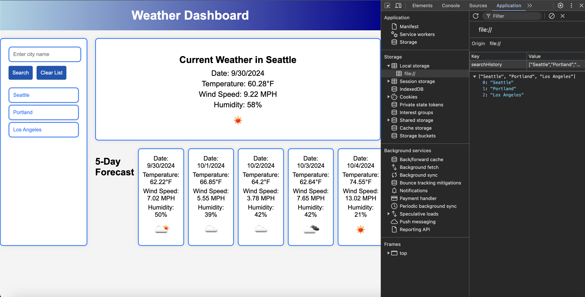

# Weather Dashboard

A dynamic and interactive weather dashboard designed to provide users with current and forecasted weather information for various cities. This app allows users to search for cities, view current weather conditions, and get a 5-day forecast. The weather data is fetched from the OpenWeather API and stored locally to ensure the user’s search history is preserved across sessions.

## Table of Contents

- [Overview](#overview)
- [Features](#features)
- [Technologies Used](#technologies-used)
- [Concepts Covered](#concepts-covered)
- [Learning Objectives](#learning-objectives)
- [Future Improvements](#future-improvements)
- [Summary](#summary)

[Demo](https://brockaltug.github.io/weather-dashboard/)

## Overview

Weather Dashboard is a web-based application that offers a clean and intuitive interface for checking the current weather and 5-day forecast for any city. It allows users to input a city name, view the current weather conditions such as temperature, wind speed, and humidity, and access a detailed 5-day forecast. Users can view their past search history, and the app dynamically updates with each search, ensuring that weather data remains accurate and up to date.

## Features

- **Search for Cities**: Users can input a city name to fetch the current weather and 5-day forecast for that city.
- **Search History**: The application stores a list of previously searched cities and allows users to click on them to view weather information again.
- **Current Weather Display**: Shows the temperature, wind speed, humidity, and weather conditions for the selected city.
- **5-Day Forecast**: Displays the upcoming weather forecast for the next 5 days, including temperature, wind speed, and humidity.
- **Persistent Storage**: The search history is saved using `localStorage`, so users can retain their history across browser sessions.
- **Responsive Design**: A user-friendly interface that works across devices of all screen sizes.

## Technologies Used

- **JavaScript**: Handles dynamic content generation and API requests.
- **HTML5/CSS3**: Provides the structure and styling for the weather dashboard.
- **OpenWeather API**: Supplies real-time weather data for cities across the world.
- **LocalStorage**: Stores the search history locally in the user’s browser for data persistence.

## Concepts Covered

- **API Integration**: Fetching weather data from the OpenWeather API and using it to dynamically update the user interface.
- **LocalStorage**: Storing and retrieving user data across sessions using `localStorage`.
- **JavaScript DOM Manipulation**: Dynamically creating and updating elements on the page in response to user interactions.
- **Responsive Design**: Implementing a design that adjusts to various screen sizes for better user experience.
- **Error Handling**: Managing scenarios where the city is not found and providing feedback to the user.

## Learning Objectives

1. Learn how to fetch data from an external API using JavaScript.
2. Understand how to dynamically manipulate the DOM based on API responses.
3. Explore methods for storing and retrieving data using `localStorage`.
4. Gain experience in building responsive user interfaces.
5. Practice using CSS for dynamic and interactive user interface design.

## Future Improvements

- **Geolocation Support**: Automatically detect the user's location and display weather data for their current city.
- **Detailed Weather Info**: Include additional weather details like air pressure, sunrise/sunset times, and weather alerts.
- **User Authentication**: Allow users to log in and save their favorite cities for quick access.
- **Dark Mode**: Add a dark mode option to improve usability in low-light environments.

## Summary

Weather Dashboard is a simple yet powerful web application for checking real-time weather and forecasts for cities worldwide. It uses the OpenWeather API to deliver accurate data and stores the user’s search history for easy reference. With a responsive and user-friendly design, it makes it easy to stay informed about current and upcoming weather conditions. A dynamic weather dashboard that allows users to search for cities and view current weather conditions and a 5-day forecast using the OpenWeatherMap API.
